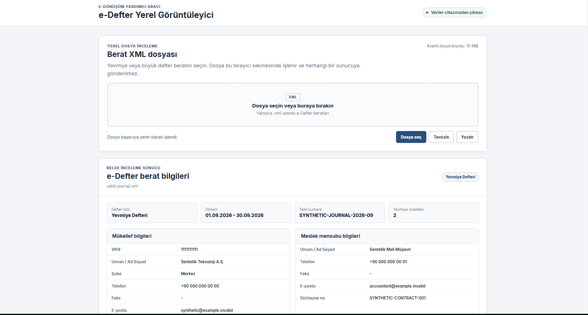
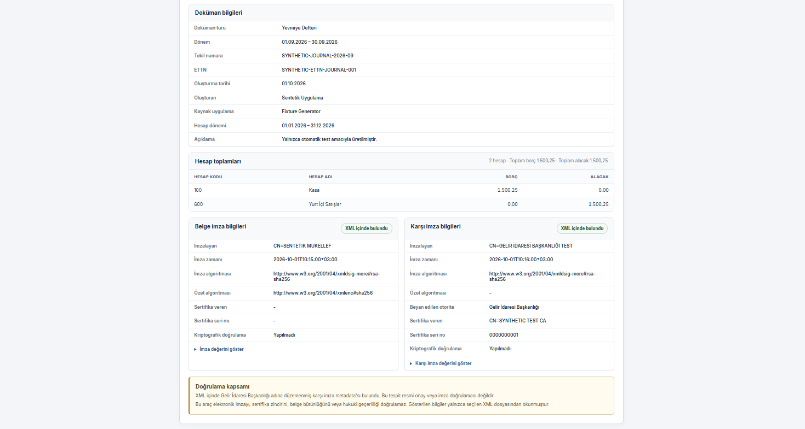

# e-Defter Yerel Görüntüleyici

[](https://github.com/Ekrem-Gungor/edefter-local-viewer/actions/workflows/ci.yml)
[](LICENSE)
[](package.json)

e-Defter berat XML dosyalarını herhangi bir sunucuya yüklemeden, doğrudan
tarayıcı içinde görüntüleyen çevrimdışı bir araçtır.

Proje, gerçek bir müşteri ortamında standart görüntüleme bağımlılığı nedeniyle
açılamayan e-Defter beyanlarını inceleyebilmek için bir iş günü içinde geliştirilen
çözümün; güvenli XML ayrıştırma, otomatik testler, kurumsal rapor arayüzü ve
tekrar üretilebilir build hattıyla ürünleştirilmiş sürümüdür.

## Ekran görüntüleri

### Belge özeti ve taraf bilgileri



### Hesap toplamları ve imza metadata bilgileri



Görüntüler yalnızca sentetik test verileriyle oluşturulmuştur.

## Neden bu proje?

e-Defter destek süreçlerinde bir berat dosyasının yalnızca görüntülenebilmesi
için ek dosyalara, masaüstü uygulamalarına veya üçüncü taraf sistemlere bağımlı
kalınabilir. Bu araç, inceleme ihtiyacını tek bir HTML dosyasıyla ve tamamen
yerel işlem modeliyle karşılar.

- Kurulum gerektirmez.
- Sunucu veya veritabanı kullanmaz.
- İnternet bağlantısına ihtiyaç duymaz.
- Seçilen XML dosyasını cihaz dışına göndermez.
- Güncel bir masaüstü tarayıcıda çalışır.

## Özellikler

- Yevmiye ve büyük defter berat XML desteği
- Sürükle-bırak veya dosya seçiciyle yerel dosya açma
- Mükellef, meslek mensubu ve doküman bilgileri
- Hesap bazında borç ve alacak toplamları
- Belge imzası ve karşı imza metadata görünümü
- Sade, kurumsal ve yazdırmaya uygun rapor arayüzü
- Anlaşılır hata ve durum mesajları
- Tek HTML dosyalık çevrimdışı dağıtım
- Sentetik fixture'larla otomatik parser, extractor, arayüz ve build testleri

## Hızlı kullanım

1. [Releases](https://github.com/Ekrem-Gungor/edefter-local-viewer/releases)
   sayfasından `EDEFTER_GORUNTULE.html` dosyasını indirin.
2. Dosyayı güncel Microsoft Edge, Google Chrome veya Firefox ile açın.
3. İncelenecek `.xml` dosyasını seçin veya dosya alanına sürükleyin.
4. Oluşturulan raporu inceleyin ya da tarayıcı üzerinden yazdırın.

Uygulamanın çalışması için Node.js gerekmez. Node.js yalnızca kaynak koddan
test ve build almak isteyen geliştiriciler için kullanılır.

## Gizlilik ve güvenlik yaklaşımı

Dosya işleme işlemi kullanıcının tarayıcısında gerçekleşir. Uygulamada harici
API çağrısı, analiz servisi, izleme betiği veya dosya yükleme mekanizması
bulunmaz.

XML dosyaları güvenilmeyen girdi olarak değerlendirilir:

- DTD ve entity tanımları reddedilir.
- Dosya boyutu, okunmadan önce 10 MiB ile sınırlandırılır.
- XBRL kök elementi ve namespace doğrulanır.
- Yalnızca `journal` ve `ledger` belge türleri kabul edilir.
- XML kaynaklı değerler `innerHTML` yerine güvenli DOM API'leriyle gösterilir.
- Testlerde gerçek müşteri verisi yerine sentetik XML örnekleri kullanılır.

Gerçek müşteri belgeleri depoya, issue içeriklerine, loglara veya ekran
görüntülerine eklenmemelidir.

## Önemli doğrulama sınırı

Bu araç XML içindeki imza ve karşı imza metadata alanlarını yalnızca görüntüler.

Araç:

- elektronik imzayı kriptografik olarak doğrulamaz,
- sertifika zinciri veya sertifika geçerliliği kontrolü yapmaz,
- belge bütünlüğü ya da hukuki geçerlilik sonucu üretmez,
- GİB doğrulama servisinin yerine geçmez.

Arayüzde görülen “imza bulundu” ifadesi, yalnızca ilgili metadata alanlarının
XML içinde mevcut olduğunu belirtir; imzanın doğrulandığı anlamına gelmez.

## Kaynak koddan çalıştırma

Gereksinimler:

- Node.js 22 veya üzeri
- npm

```bash
npm ci
npm test
```

Geliştirme sunucusu:

```bash
npm run dev
```

Coverage raporu:

```bash
npm run test:coverage
```

Tek dosyalık production build:

```bash
npm run build
```

Build sonucu:

```text
dist/EDEFTER_GORUNTULE.html
```

## Proje yapısı

```text
src/
├── parser/       XML belgesinden görüntüleme modelini çıkarır
├── ui/           Verileri güvenli DOM işlemleriyle rapora dönüştürür
├── xml/          XML güvenlik ve belge türü kontrollerini yürütür
├── main.js       Dosya seçimi ve kullanıcı akışını yönetir
└── styles.css    Ekran ve yazdırma stillerini içerir

scripts/          Tek HTML dosyalık build işlemi
tests/            Sentetik fixture ve otomatik testler
docs/             Kapsam, mimari ve release dokümantasyonu
```

## Dokümantasyon

- [Ürün kapsamı](docs/product-scope.md)
- [Mimari](docs/architecture.md)
- [v1.0.0 release notları](docs/release-notes-v1.0.0.md)
- [Release kontrol listesi](docs/release-checklist.md)
- [Güvenlik politikası](SECURITY.md)
- [Değişiklik günlüğü](CHANGELOG.md)

## Proje durumu

v1.0.0 kapsamındaki güvenli XML ayrıştırma, veri çıkarımı, kurumsal rapor
arayüzü, otomatik testler, CI ve tek dosyalık build hattı tamamlandı. Proje ilk
kararlı GitHub Release yayınına hazırlanmaktadır.

## Lisans

Bu proje [MIT Lisansı](LICENSE) ile lisanslanmıştır.
